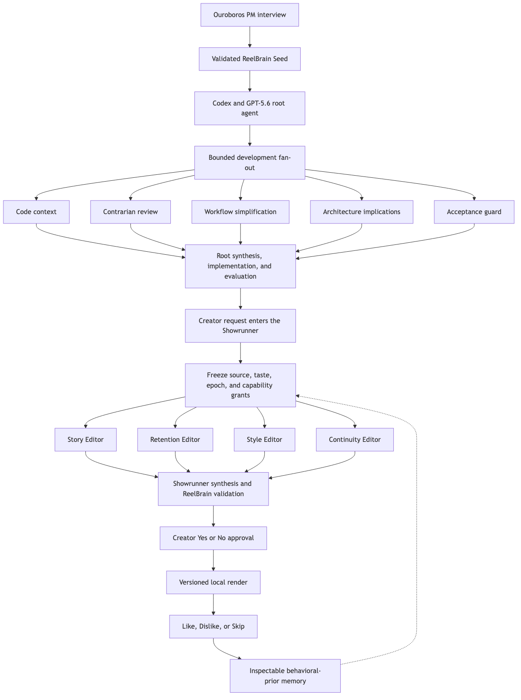

<p align="center">
  
</p>

# ReelBrain

ReelBrain is a local-first AI video-editing agent team that turns raw footage into creator-review drafts, learns each creator’s taste from explicit feedback, and applies that history to future edits without treating memory as source evidence.

<p align="center">
  
</p>

ReelBrain is an OpenAI Build Week submission in the **Work and Productivity** track.

## Demo links

- Landing page: [reelbrain-landing-xi.vercel.app](https://reelbrain-landing-xi.vercel.app/)
- Three-minute product walkthrough: [Watch on YouTube](https://youtu.be/hVTOnNQee68)
- Build Week submission: [ReelBrain on Devpost](https://devpost.com/software/reelbrain)
- Community Edition releases: [GitHub Releases](https://github.com/Q00/ReelBrain/releases)

## Key features

- Four editable editorial personas for story, retention, style, and continuity, coordinated by a Showrunner.
- Local video preflight, playback, fullscreen review, draft version history, and non-destructive revisions.
- Grounded short-form and long-form planning with Korean and English caption artifacts.
- Explicit Yes/No gates for revisions and human approval before generated tools can be built or deployed.
- Inspectable agent activity, tool calls, orchestration rationale, workflow progress, and durable evidence.
- Like, Dislike, and Skip feedback loops that create explicit preferences, corrections, or tentative taste episodes.
- Creator-controlled Taste Profile records that can be inspected, edited, disabled, or deleted.
- ACP-backed semantic tools and evidence-gated Sleep optimization for prompts, tool descriptions, and workflows.

## Agent workflow and Taste Profile

| Story Editor | Retention Editor | Style Editor | Continuity Editor |
| --- | --- | --- | --- |
|  |  |  |  |
| Finds a complete educational arc. | Strengthens the hook and pacing. | Applies approved creator taste. | Protects meaning, caveats, and endings. |

The Showrunner receives the creator’s request and selected-draft context, then answers directly or consults the four editors. Approved effects run through bounded semantic tools, produce versioned local artifacts, and remain in creator review until the creator decides otherwise.

The Taste Profile is a behavioral prior, not evidence. A Like becomes an explicit preference with provenance. A Dislike records the creator’s reason and uses it to plan another draft. Skip stores the original request only as a tentative episode; it does not become active taste until consistent evidence exists and the creator confirms it. Current steering always overrides stored taste.

## Quick start and judge testing

For the fastest start on Apple Silicon, download the [latest GitHub release](https://github.com/Q00/ReelBrain/releases/latest). Use the PKG as the installer, or download the ZIP for the portable `ReelBrain.app` runner. The installed app includes ReelBrain’s Python modules and stores local state in `~/.ReelBrain`; Python, FFmpeg/FFprobe, and Codex or ChatGPT remain host prerequisites. The current app bundle is ad-hoc signed but the installer is not Developer ID signed or notarized, so macOS may require Control-clicking the package or app and choosing **Open** on first launch.

Prerequisites: macOS on Apple Silicon, Python 3.11+, Node.js, FFmpeg, FFprobe, `uv`, and the Tauri development prerequisites.

```bash
git clone https://github.com/Q00/ReelBrain.git
cd ReelBrain
uv sync --dev
uv run reelbrain doctor

cd desktop
npm install
npm run tauri dev
```

Judge test path:

1. Launch the desktop app and connect Codex through the official ChatGPT sign-in flow.
2. Open an existing creator-review project or drag a creator-owned video into Projects.
3. Play a draft, use the local timestamp control, and send a revision request to ReelBrain or an `@agent`.
4. Review the orchestration rationale and choose **Yes** on the structured revision card.
5. Watch the real render progress, open the new version, then choose **Like**, **Dislike**, or **Skip**.
6. Open **Memory & Evidence** to inspect the resulting preference, correction, tentative episode, and provenance.

Optional provider-backed image and thumbnail features require `OPENAI_API_KEY=<YOUR_OPENAI_API_KEY>` or `OPEN_API_KEY=<YOUR_OPENAI_API_KEY>` in a local `.env`. Do not commit credentials.

## Sample data

- Download the judge sample package from `[SAMPLE_DATA_URL]`, extract it locally, and keep its directory outside Git.
- Or use a creator-owned MP4, MOV, M4V, MKV, or WebM containing both video and audio.
- For the shortest review path, use a 30–60 second rendered draft with adjacent `.en.srt`, `.ko.srt`, and `.ass` caption files.
- For full dogfood preparation, replace placeholders below with local paths and identifiers:

```bash
uv run reelbrain dogfood prepare <VIDEO_OR_ZIP_PATH> \
  --output <LOCAL_OUTPUT_DIRECTORY> \
  --project-id <PROJECT_ID> \
  --creator-id <CREATOR_ID> \
  --rights-license creator-owned \
  --shorts 3 \
  --minimum-long-minutes 10 \
  --maximum-long-minutes 15
```

Provider confidence does not prove caption accuracy. Correct captions against the source before treating them as creator-approved.

## How Codex with GPT-5.6 accelerated development

Ouroboros was used to run PM interviews, clarify requirements, generate the ReelBrain Seed, execute the specification, and evaluate the resulting system. Codex with GPT-5.6 then helped turn those decisions into a working Python runtime and Tauri desktop product: it implemented the governed agent and tool architecture, built the dogfood render pipeline, debugged provider and media failures, added persistent taste/evidence flows, and repeatedly exercised the real desktop UI with Computer Use.

The most valuable contribution was not raw code generation. Codex maintained continuity across product decisions, architecture, implementation, tests, and visual QA while preserving the creator’s explicit governance boundaries.

## Codex & GPT-5.6 build session

**Codex session ID:** `019f7e65-0f11-7333-b3fe-c3d8401e0e2a`

This session is the primary development record for the Build Week submission. Codex with GPT-5.6 worked across the full product loop rather than only generating isolated code:

- Translated the Ouroboros PM interview and validated Seed into the governed ReelBrain runtime and Tauri desktop application.
- Implemented and debugged four-agent fan-out, Showrunner synthesis, structured human approvals, ACP tool governance, versioned rendering, and creator-controlled Taste Profile evidence.
- Diagnosed real media, transcription, provider, fullscreen, chat, focus, progress, and persistent-state failures while exercising the desktop product through Computer Use.
- Built and ran the Python, TypeScript, and Rust verification suites, then used the results to guide fixes and regression checks.

GPT-5.6 accelerated implementation, debugging, testing, and architectural continuity. The human creator remained responsible for ReelBrain’s product philosophy, governance boundaries, editing-agent model, memory-as-behavioral-prior principle, and final product decisions.

## How we developed ReelBrain

ReelBrain began with an Ouroboros PM interview rather than a prewritten feature list. The interview turned the creator’s initial idea into a validated Seed: solo educational creators, self-contained 30–60 second highlights, accurate bilingual captions, explicit feedback as the basis for taste learning, and the creator as the final source of truth. That Seed became the contract for Codex with GPT-5.6 to implement, evaluate, and repeatedly QA the product.

During development, Ouroboros and Codex fanned out bounded questions to independent subagents instead of asking one agent to reason about every concern at once. Advisory lanes examined code context, challenged assumptions, simplified the workflow, traced architecture implications, and guarded acceptance criteria. The root agent synthesized their evidence, made the implementation change, and ran the relevant tests. This made disagreement visible while keeping one accountable orchestrator.

The same pattern became ReelBrain’s product architecture. A creator request enters the Showrunner, ReelBrain freezes the source catalog, Taste Profile snapshot, workflow epoch, and capability grants, and Codex runs four isolated editorial lanes. Their results are treated as proposals—not authority—until ReelBrain validates their candidate references and the creator approves the effect.



The editable [Mermaid source](docs/assets/reelbrain-development-flow.mmd) is kept beside the exported diagram.

Codex owns ephemeral execution: spawning lanes, concurrency, retries, and synthesis. ReelBrain owns durable trust: what source was frozen, what each agent was allowed to access, what was attempted, which proposal was accepted, what was rendered, and what the creator chose to remember. Taste is supplied to later agents as a scoped behavioral prior; it never replaces transcript or media evidence.

## Key product and engineering decisions made by the human creator

- Memory is a behavioral prior; it is never evidence for what the source video says.
- The creator is the source of truth for their work, voice, brand, and final approval.
- ReelBrain uses exactly four visible editing personas; the Showrunner orchestrates them rather than acting as a fifth editor.
- Outcomes determine editing quality. Exact tool-sequence assertions are reserved for safety and required evidence steps.
- Natural-language requests are judged by the LLM, not keyword or approval regexes. Effects begin only through structured UI controls.
- Agents may request new tools through ACP, but humans approve quarantined build, testing, and deployment separately.
- Revisions are non-destructive, versioned, locally validated, and never presented as complete until a changed video passes verification.
- Sleep may propose bounded configuration changes, but creator memory, permissions, consent, secrets, and production promotion remain governed.

## Current limitations

- The certified development baseline is macOS on Apple Silicon; other platforms are not yet validated.
- The desktop revision renderer currently supports bounded visual finishing and loudness plans. Arbitrary timeline edits, caption rewrites, music replacement, or new reframing require additional governed tool capabilities.
- Caption quality still requires creator correction or an independent reference; ReelBrain does not claim automatic 95% accuracy.
- Long-form workflows and provider-backed thumbnail generation require more setup and take longer than the desktop review loop.
- There is no direct social publishing in the current version.
- Taste synchronization, backups, managed rendering, and hosted project history are not part of the local Community Edition today.

## Community Edition vs. Creator Cloud

The **Community Edition** is the complete source-available local product: creators can inspect, modify, and self-host it subject to the Sustainable Use License. Local editing, agent configuration, Taste Profile controls, evidence, and governed tools are not intentionally crippled to force an upgrade.

The planned **Creator Cloud** sells convenience: managed rendering, no API-key setup, persistent Taste Brain synchronization, project history, backups, automatic updates, and creator support. It is not positioned as a gate on the local product’s core editing capabilities.

## Contributing

Issues, reproducible bug reports, evaluation fixtures, documentation fixes, and focused pull requests are welcome. Before contributing:

```bash
uv sync --dev
uv run pytest -q

cd desktop
npm install
npm run build
cd src-tauri
cargo test
```

Do not include private footage, transcripts, provider credentials, generated `.env` files, or unlicensed media in contributions. By contributing, you agree that your contribution may be distributed under the repository’s current license and any applicable contributor terms at `[CONTRIBUTOR_TERMS_URL]`.

## License

ReelBrain is **source-available** under the [Sustainable Use License](LICENSE). Individuals may use, modify, and self-host ReelBrain for personal, educational, research, and internal business purposes, subject to the exact `LICENSE` terms.

Offering ReelBrain as a competing paid hosted service, reselling it, or commercially providing it to third parties is outside the permitted uses and requires a separate commercial license from [jqyu.lee@gmail.com](mailto:jqyu.lee@gmail.com). The `LICENSE` file is authoritative if this summary and the license differ.
