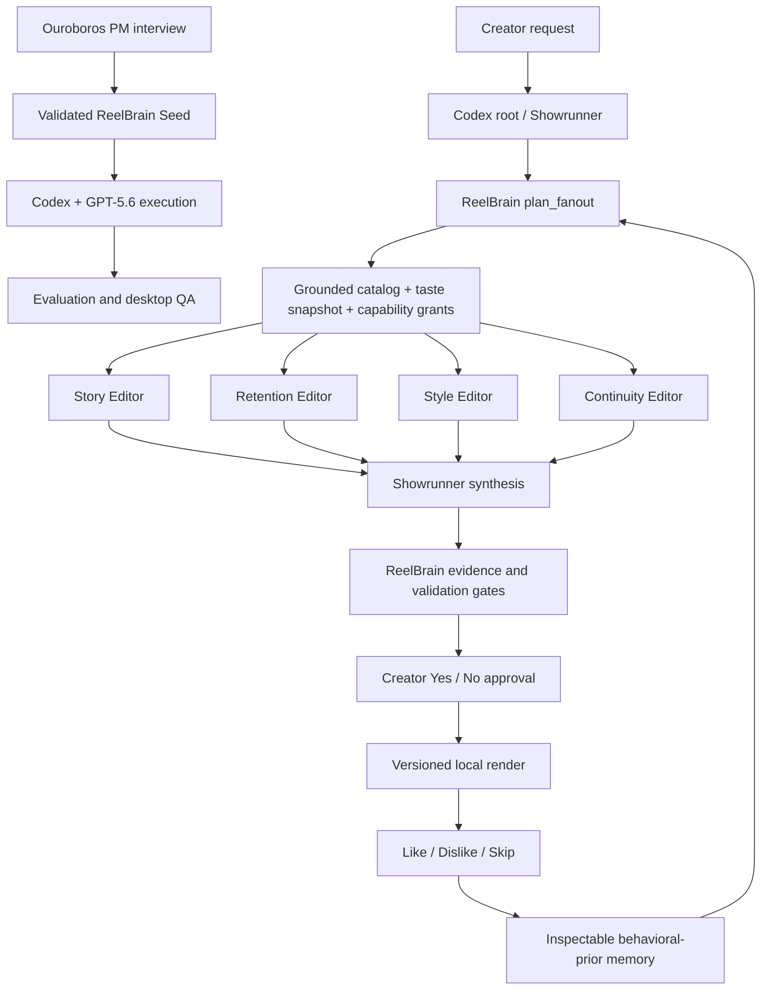

# ReelBrain v0.1.0 — Governed creator editing workspace

ReelBrain v0.1.0 is the first source-available Community Edition release of the local-first AI video-editing agent team for creator-review drafts, explicit taste learning, and governed agent execution.

## Highlights

- Four editable editorial personas—Story, Retention, Style, and Continuity—coordinated by a Showrunner.
- Local project import, video playback, timestamp mentions, fullscreen review, non-destructive revisions, and version history.
- Rich creator chat with visible orchestration rationale, agent activity, tool calls, approval cards, and render progress.
- Structured Yes/No approval before revisions and human approval before generated tools can be built or deployed.
- Like, Dislike, and Skip review loops connected to an inspectable Taste Profile and evidence ledger.
- Grounded fan-out with frozen source catalogs, scoped taste snapshots, capability grants, workflow epochs, and accepted-plan validation.
- Korean and English caption artifacts in the preparation workflow.

## Built through Ouroboros and Codex with GPT-5.6

ReelBrain started as an Ouroboros PM interview. The interview clarified the creator, editing outcome, acceptance criteria, memory philosophy, and governance boundaries, then generated a validated Seed. Codex with GPT-5.6 used that Seed to implement the Python runtime and Tauri desktop application, fan out bounded engineering questions, debug real media and UI failures, run verification, and preserve architectural continuity across the product loop.

Primary Codex development session: `019f7e65-0f11-7333-b3fe-c3d8401e0e2a`



Ouroboros development fan-out used advisory lanes such as code-context inspection, contrarian review, simplification, architecture implications, and acceptance guarding. ReelBrain’s creator workflow uses four stable editorial personas. In both cases, independent agents return bounded proposals to a root orchestrator; they do not directly acquire durable authority.

Codex owns ephemeral scheduling, concurrency, retries, and synthesis. ReelBrain owns durable trust: the frozen source and taste snapshots, capability grants, evidence, validation, approvals, accepted plan, render version, and creator memory. Multiple tool trajectories may be valid, so outcome quality determines editing quality while sequence assertions are reserved for required safety and evidence steps.

## Install and verify

Download `ReelBrain-v0.1.0-macos-arm64.zip` from the release assets. This initial build targets Apple Silicon, is ad-hoc signed, and is not notarized, so macOS may require an explicit local approval before first launch.

SHA-256: `163e7bd0aa987331b3a22ef1f5541c75d1c462cdac8ef7b82aac9cb4fd4cc233`

Developers can run the source build with:

```bash
git clone https://github.com/Q00/ReelBrain.git
cd ReelBrain
uv sync --dev
uv run reelbrain doctor

cd desktop
npm install
npm run tauri dev
```

## Known limitations

- macOS on Apple Silicon is the validated baseline; other platforms are not yet validated.
- The release is not Apple-notarized.
- Arbitrary timeline edits, caption rewrites, music replacement, or new reframing require additional governed tool capabilities.
- Caption accuracy still needs creator correction or an independent reference.
- Direct social publishing is not included.
- Managed rendering, synchronization, backups, updates, and creator support are planned Creator Cloud conveniences, not restrictions on the local Community Edition.

## License

ReelBrain is source-available under the Sustainable Use License. The repository `LICENSE` file is authoritative.
