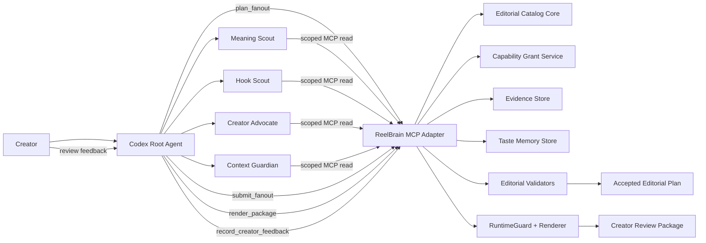
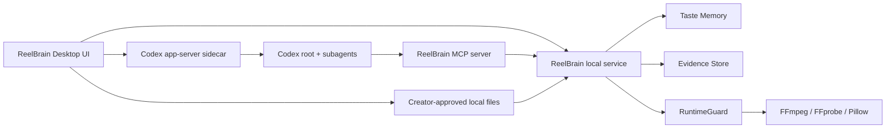
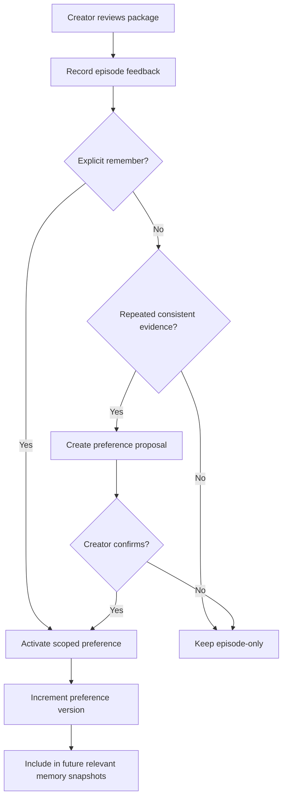
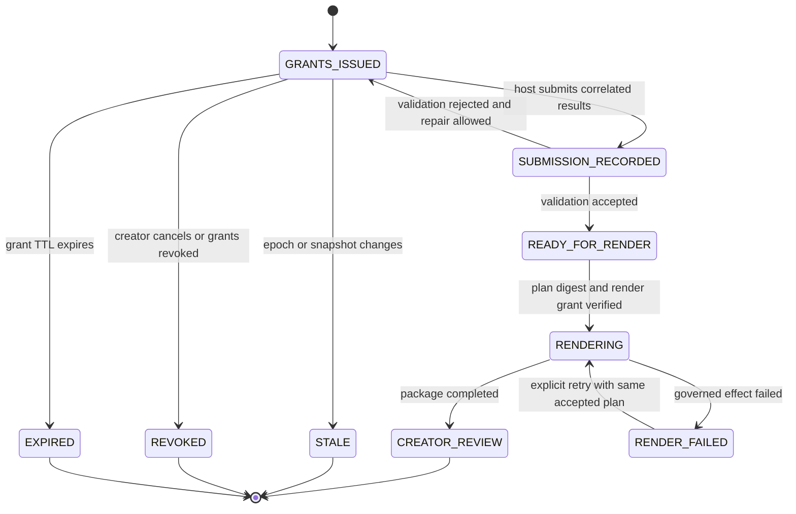
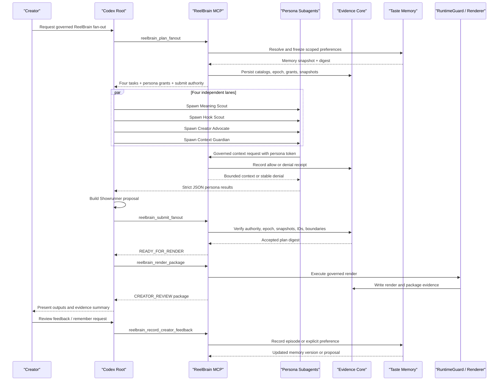

# ReelBrain Governed Evolving Fan-Out Harness

> Final Architecture Design  
> Date: 2026-07-21  
> Status: Final design — core architecture QA PASS (0.90); desktop product layer added with official Codex authentication constraints
> Primary host: Codex  
> Transport: MCP over stdio  

## 1. Executive Summary

ReelBrain will become a **governed, evidence-producing, taste-aware agent fan-out harness**.

Codex owns the ephemeral execution of specialized subagents. ReelBrain owns the durable trust boundary: source-grounded candidate catalogs, capability grants, denial receipts, workflow epochs, validation decisions, spend evidence, accepted-plan digests, creator taste memory, and render authorization.

The core interaction is:

```text
ReelBrain issues bounded work and least-privilege capability grants.
Codex runs independent editorial agents.
ReelBrain treats every result and capability use as untrusted input.
Only a validated plan digest may enter rendering.
Creator-approved feedback becomes scoped, versioned taste memory for later runs.
```

This is deliberately not a thin MCP transport and not an MCP-owned scheduler.

- It is **not a thin transport** because ReelBrain persists governance and evidence state.
- It is **not a scheduler** because Codex owns agent threads, concurrency, retries, and execution lifecycle.
- It is **not autonomous memory mutation** because subagents may read only scoped memory snapshots and may never write durable creator memory.

## 2. Validation Outcome

The design was re-evaluated against the current repository, including:

- `reelbrain/editorial.py`
- `reelbrain/agents.py`
- `reelbrain/agent_runtime.py`
- `reelbrain/runtime_guard.py`
- `reelbrain/memory.py`
- `reelbrain/sleep.py`
- the existing editorial, governance, memory, steering, deletion, and promotion tests

The first strict QA pass returned `REVISE (0.76)` and identified missing callable steering/feedback paths, an invalid generic capability check, incomplete durable deletion semantics, and underspecified transactional state. After correction, the independent re-review returned `PASS (0.90)`. Its remaining contract-clarity suggestions—creator-review grant issuance, root control authority, restart-safe token digests, persistence metadata, and schema limits—are incorporated in this final version.

The initial design required four corrections before it was implementation-ready.

| Initial gap | Final correction |
|---|---|
| Orchestration and evidence state were treated as one state problem | Codex owns orchestration state; ReelBrain owns governance and evidence state |
| Capability Packets risked being descriptive metadata | Every ReelBrain tool call enforces a server-side grant and records allow or denial evidence |
| Memory and taste were discussed but not bound to the fan-out protocol | Every fan-out binds a scoped memory snapshot digest; durable changes use the existing consent-first memory contract |
| The existing deterministic and provider-backed Showrunners were treated as nearly interchangeable | MVP uses a host-produced proposal plus existing validators; deterministic score fusion is a later adapter, not a drop-in reuse |

The resulting architecture is internally consistent with the repository's current invariants:

- memory is a behavioral prior, never source evidence;
- ordinary episode feedback is not durable without explicit confirmation;
- current steering outranks edit overrides and stored preferences;
- deleted memory cannot be resurrected by import, replay, rollback, or Sleep;
- stale work is rejected through workflow epochs;
- rendering remains governed and stops at `CREATOR_REVIEW`.

## 3. Product Thesis and Moat

The product is not differentiated by spawning four agents. Any competent host can perform parallel inference.

ReelBrain's defensible layer is the system surrounding that inference:

1. **Grounded fan-out** — agents rank immutable source-derived candidate IDs rather than inventing timestamps.
2. **Least privilege** — each agent receives a capability grant bounded by tool, candidate, path, destination, budget, epoch, and expiry.
3. **Observable denial** — unauthorized attempts fail before effects and produce stable denial receipts.
4. **Evidence continuity** — every grant, use, denial, submission, validation, memory snapshot, accepted plan, and render is linked in an inspectable bundle.
5. **Governed growth** — creator taste transfers across relevant runs, but only through scoped, versioned, consent-first memory.
6. **Effect gating** — agent judgment never directly authorizes filesystem writes, provider spend, rendering, or publishing.

The concise product definition is:

> ReelBrain lets a host run a growing team of editorial agents while ReelBrain controls what they may access, proves what they attempted, rejects stale or ungrounded work, and safely carries creator-approved taste into future runs.

## 4. Goals

- Run Meaning Scout, Hook Scout, Creator Advocate, and Context Guardian as independent Codex subagents.
- Preserve transcript chunks, timestamps, candidate IDs, source fingerprints, rights, and render boundaries as ReelBrain-owned truth.
- Give every subagent a least-privilege Capability Packet.
- Record allow and denial decisions as durable evidence.
- Reject results from old workflow epochs or old memory snapshots.
- Produce a canonical `EditorialPlan` only from validated catalog references.
- Gate rendering on an accepted plan digest.
- Apply relevant creator preferences as scoped behavioral priors.
- Convert feedback into durable taste only through explicit remember or confirmed proposals.
- Keep provider-backed editorial inference as a fallback during migration.
- Support generic Codex subagents when project custom-agent profiles are unavailable.
- Provide a desktop application where creators can connect Codex, drag and drop local video, chat with ReelBrain, inspect agent activity, review outputs, and manage their taste memory.

## 5. Non-Goals

- ReelBrain MCP does not directly call a private Codex spawn API.
- ReelBrain does not persist Codex agent thread status, scheduling queues, or retry attempts.
- Capability Packets do not claim control over arbitrary host shell commands or tools outside ReelBrain.
- Subagents do not receive raw secrets, provider credentials, publish authority, or unrestricted source paths.
- Subagents do not write creator memory.
- A single rejected or selected edit does not automatically become a durable preference.
- Persona diversity ablation is not required for the hackathon build.
- Direct social publishing remains outside the first version.
- ReelBrain does not implement or impersonate an undocumented OpenAI/Codex OAuth client.
- Drag-and-drop does not imply automatic upload, provider consent, spend, or publishing.

## 6. State Ownership

| State plane | Owner | Durable | Examples |
|---|---|---:|---|
| Orchestration | Codex | No | active agents, concurrency, retry count, thread lifecycle |
| Ground truth | ReelBrain | Yes | transcript chunks, candidate catalogs, timestamps, source digest |
| Capability governance | ReelBrain | Yes | issued grants, expiry, revocation, allow/deny decisions |
| Workflow evidence | ReelBrain | Yes | epoch, submissions, validation trace, accepted-plan digest |
| Provider governance | ReelBrain | Yes | consent, destinations, reservation, spend receipts |
| Creator taste memory | ReelBrain | Yes | scoped preferences, provenance, versions, tombstones |
| Render execution | ReelBrain via `RuntimeGuard` | Yes | path authorization, tool execution, package evidence |

The ownership rule is:

```text
If the state answers “what is running?”, Codex owns it.
If the state answers “what was allowed, attempted, accepted, remembered, or rendered?”, ReelBrain owns it.
```

## 7. System Architecture



### 7.1 Codex Host

Codex is responsible for:

- reading the fan-out contract;
- spawning one isolated subagent per task;
- selecting the preferred custom-agent profile when available;
- falling back to a generic subagent with the full task prompt;
- waiting for all expected results;
- correlating results by `task_id`;
- producing the Showrunner proposal;
- calling ReelBrain submission and render tools;
- retaining only ephemeral scheduling and retry state.

### 7.2 ReelBrain MCP Adapter

The adapter is responsible for:

- exposing stable MCP tool schemas;
- returning equivalent dispatch information in readable `content`, `structuredContent`, and `_meta` where supported;
- translating protocol objects into ReelBrain core service calls;
- never containing editorial policy or trust decisions that belong in the core.

### 7.3 Governance and Evidence Core

The core is responsible for:

- issuing and validating capability grants;
- storing immutable catalog and memory snapshots;
- maintaining workflow epochs;
- recording allow, denial, submission, validation, spend, and render events;
- generating denial receipts and accepted-plan digests;
- failing closed on missing, stale, expired, revoked, or malformed authority.

### 7.4 Taste Memory Plane

The memory plane is responsible for:

- recording episode feedback;
- immediately activating explicitly remembered preferences;
- generating proposals only from repeated consistent evidence;
- requiring confirmation before inferred preferences become durable;
- resolving preferences by scope and precedence;
- supporting inspect, edit, disable, re-enable, export, import, and delete;
- preventing deleted values from resurrection through deletion fences;
- producing a versioned memory snapshot for each fan-out.

### 7.5 ReelBrain Desktop Application

ReelBrain Desktop is the creator-facing product shell around the governed fan-out harness. It turns the local runtime, Codex orchestration, memory ledger, evidence stream, and renderer into one approachable workflow for non-technical creators.

The primary experience is:

```text
Connect Codex
→ drag and drop a raw video
→ talk to ReelBrain about the desired edit
→ watch the editorial agent team work
→ review grounded Shorts and long-form drafts
→ inspect or correct “Your Taste”
→ approve a creator-review package
```

The desktop application owns presentation and local process lifecycle. It does not own editorial truth, permissions, durable taste rules, or render authorization.

### 7.6 Codex Authentication Decision

Codex officially supports browser-based **Sign in with ChatGPT** for the ChatGPT desktop app, Codex CLI, and IDE extension. Codex app-server is the documented deep-integration surface for products that need authentication, conversation history, approvals, and streamed agent events.

ReelBrain Desktop therefore uses a **Codex-managed login**, not a ReelBrain-implemented copy of OpenAI's OAuth flow:

1. start a local `codex app-server` sidecar over stdio or a local Unix socket;
2. query the Codex authentication state;
3. when signed out, present `Connect Codex` and invoke the official Codex browser login flow;
4. let Codex store and refresh its own credentials using its configured keyring or credential store;
5. communicate with Codex through app-server messages rather than reading credential files.

ReelBrain must never:

- register or imitate an undocumented Codex OAuth client;
- scrape browser sessions;
- read, copy, upload, or parse `~/.codex/auth.json`;
- expose Codex access tokens to the renderer, MCP tasks, logs, memory, or evidence bundle;
- claim that every ChatGPT account has the same Codex entitlement or workspace permissions.

The UI copy should say **Connect Codex** or **Continue with ChatGPT through Codex**, not imply that ReelBrain itself is an OpenAI identity provider.

Creators may alternatively use Codex's supported API-key authentication, but that path uses standard OpenAI API billing rather than included ChatGPT plan usage.

Official references:

- [Codex Authentication](https://learn.chatgpt.com/docs/auth)
- [Codex App Server](https://learn.chatgpt.com/docs/app-server)

### 7.7 Desktop Runtime Topology



Recommended desktop stack:

| Layer | Recommendation | Reason |
|---|---|---|
| Desktop shell | Tauri 2 | small bundle, native file dialogs, explicit sidecar permissions |
| UI | React + TypeScript | fast product iteration and accessible component ecosystem |
| Local backend | existing Python ReelBrain runtime | preserves current media, governance, and memory implementation |
| Agent backend | local Codex app-server sidecar | official rich-client integration surface |
| Tool bridge | ReelBrain MCP over stdio | host-driven fan-out contract |
| Media | FFmpeg, FFprobe, Pillow | existing deterministic local rendering |
| Secrets | OS keyring through Codex/runtime-owned stores | desktop UI never handles raw provider credentials |

Local stdio or Unix sockets are preferred. Codex app-server WebSocket transport is currently documented as experimental and unsupported, so it must not be the default desktop architecture.

### 7.8 Desktop Information Architecture

The application has five primary surfaces.

#### Home

- large drag-and-drop video target;
- recent projects;
- Codex connection status;
- local runtime health for FFmpeg, FFprobe, storage, and MCP;
- one clear primary action: `Drop a video to begin`.

#### Project Workspace

- source-video player and transcript timeline;
- ReelBrain conversation panel;
- agent-team activity with Meaning, Hook, Creator, and Context lanes;
- candidate cards with grounded timestamps and reasons;
- current steering and active edit constraints;
- progress expressed as creator outcomes, not internal pipeline jargon.

#### Your Taste

- active preference cards grouped by voice, hook, pacing, context, captions, and visual style;
- scope badges such as `Shorts`, `Technical`, and `Korean`;
- provenance and source run;
- confidence and explicit-versus-confirmed status;
- edit, disable, re-enable, and forget actions;
- proposed preferences awaiting creator confirmation;
- visible statement that taste guides behavior but is not source evidence.

#### Review

- side-by-side Short previews and one long-form draft;
- title, rationale, source range, captions, and thumbnail;
- approve, reject, revise, and `remember this preference` actions;
- clear `CREATOR_REVIEW` state;
- no publish-ready claim without the existing gates.

#### Evidence

- human-readable timeline of permissions, agent activity, denial receipts, memory versions, accepted-plan validation, and rendering;
- advanced raw bundle inspection behind a disclosure control;
- clear distinction between normal agent disagreement and a denied effect.

### 7.9 Drag-and-Drop Ingestion

Dropping a video does not immediately upload or spend money.

```text
drop file
→ inspect locally
→ inventory codec, duration, streams, and source digest
→ show proposed workflow and provider effects
→ obtain explicit approval where required
→ start transcription and fan-out
```

The desktop drop handler passes only creator-approved absolute paths to ReelBrain. It does not copy files outside the selected project workspace without disclosure. Unsupported media, missing audio, excessive duration, and inaccessible paths fail before agent execution.

### 7.10 Conversational Control

The chat surface is the main creator steering interface.

Examples:

```text
“Make the hooks technical, not sensational.”
“Keep the complete caveat in the second Short.”
“Why did you reject this clip?”
“Remember that I prefer bilingual captions.”
“Forget my preference for fast pacing.”
```

Chat messages are classified into:

- episode instruction;
- current steering that advances the workflow epoch;
- preference feedback;
- explicit remember request;
- preference edit, disable, or delete request;
- read-only explanation or evidence query.

The desktop app confirms destructive or durable memory actions and routes them through the corresponding governed MCP tool.

### 7.11 Desktop Security Boundary

- File access begins with a native user selection or drag-and-drop event.
- The renderer receives only accepted plan and output-root authority.
- Codex credentials remain inside Codex-managed storage.
- OpenAI provider keys remain inside ReelBrain's existing secret resolver and `RuntimeGuard` flow.
- Persona agents use read-only sandboxes and scoped ReelBrain MCP grants.
- The desktop UI receives redacted evidence views, never raw capability tokens.
- Crash reports and analytics exclude transcript content, taste values, source paths, tokens, and provider payloads by default.
- Projects remain local unless a future explicit synchronization feature is separately authorized.

## 8. Agent Definitions

### 8.1 Canonical Persona Contract

The canonical persona definition lives in ReelBrain's protocol contract, not exclusively in a Codex-specific file.

Each task contains:

- stable `persona` identifier;
- optional `preferred_agent_type`;
- complete self-contained instructions;
- task-specific catalog or context reference;
- scoped taste-memory view;
- result schema;
- Capability Packet.

This prevents a missing custom-agent profile from breaking the protocol.

### 8.2 Project Custom Agents

Project profiles improve consistency and allow persona-specific model and sandbox settings.

```text
.codex/agents/
├── meaning-scout.toml
├── hook-scout.toml
├── creator-advocate.toml
└── context-guardian.toml
```

Recommended properties:

```toml
name = "meaning-scout"
description = "Ranks grounded ReelBrain candidates for educational meaning."
model = "gpt-5.6-terra"
model_reasoning_effort = "medium"
sandbox_mode = "read-only"
developer_instructions = """
Use only the supplied candidate IDs and scoped ReelBrain MCP tools.
Never invent source facts, timestamps, paths, or permissions.
Return only JSON matching the supplied task schema.
"""
```

The profile name is a host optimization, not a protocol ABI. The full task prompt remains authoritative.

### 8.3 Persona Memory Views

Each persona receives only relevant preference categories.

| Persona | Example memory categories |
|---|---|
| Meaning Scout | educational depth, explanation completeness, preferred concepts |
| Hook Scout | hook style, sensationalism tolerance, pacing |
| Creator Advocate | voice, brand language, preferred terms, reframing style |
| Context Guardian | caveat preservation, context tolerance, prohibited distortions |

The memory view contains resolved values and provenance identifiers, not the entire creator memory ledger.

## 9. MCP Tool Contract

The final design uses six tools. The context tool makes Capability Packets observable and enforceable; the steering and feedback tools make epoch changes and taste growth callable rather than merely descriptive.

### 9.1 `reelbrain_plan_fanout`

Called by the Codex root agent.

Responsibilities:

1. authorize source and transcript reads;
2. fingerprint the source and transcript;
3. build canonical short and long-form catalogs;
4. resolve relevant taste preferences;
5. freeze a memory snapshot and compute its digest;
6. bind source, catalog, memory, and epoch into a fan-out evidence record;
7. issue one persona grant per task and one root control grant;
8. return the host-driven dispatch contract.

Example response:

```json
{
  "protocol": "reelbrain.dev/governed-fanout/v1alpha1",
  "status": "GRANTS_ISSUED",
  "host_action": "spawn_subagents",
  "fanout_id": "fanout_123",
  "epoch": 7,
  "snapshot_digest": "sha256:catalog...",
  "memory_snapshot_digest": "sha256:memory...",
  "correlation_key": "task_id",
  "expected_result_count": 4,
  "tasks": [],
  "root_authority": {
    "grant_id": "grant_root_control",
    "token": "opaque-one-time-visible-token",
    "allowed_tools": ["reelbrain_submit_fanout", "reelbrain_steer_fanout"]
  },
  "submit_tool": "reelbrain_submit_fanout"
}
```

### 9.2 `reelbrain_get_task_context`

Called by a persona subagent when it requires governed candidate context.

Input:

```json
{
  "capability_token": "opaque-token",
  "fanout_id": "fanout_123",
  "task_id": "task_meaning",
  "epoch": 7,
  "candidate_ids": ["short_a", "short_b"]
}
```

The service verifies:

- token hash and grant status;
- fan-out, task, persona, epoch, and expiry;
- requested tool membership;
- candidate ID subset;
- memory view scope;
- request size and rate bounds.

It returns only canonical candidate context authorized by the grant.

### 9.3 `reelbrain_submit_fanout`

Called by the Codex root agent after collecting all persona results and producing a Showrunner proposal.

The submission must include:

- root control capability token;
- `fanout_id` and epoch;
- catalog and memory snapshot digests;
- exactly one result for each expected `task_id`;
- a strict Showrunner proposal;
- normalized submission idempotency key.

The service validates:

1. orchestrator authority;
2. protocol version and epoch;
3. source, catalog, and memory snapshot digests;
4. exact task and persona correlation;
5. persona result schemas;
6. candidate IDs against persisted catalogs;
7. short count, overlap, duration, natural boundaries, and diversity;
8. long-form duration, boundaries, title, thesis, and rationale;
9. duplicate or conflicting retries;
10. all denial and spend evidence associated with the fan-out.

On success it stores a canonical `EditorialPlan` and returns its digest.

### 9.4 `reelbrain_render_package`

Called only after submission succeeds.

The service requires:

- accepted `plan_digest`;
- current source digest;
- current epoch;
- output-root authorization;
- render-specific capability generated after plan acceptance.

It invokes `RuntimeGuard` and existing renderer code, writes evidence artifacts, and returns a package in `CREATOR_REVIEW` state. A successful response also issues a creator-review grant bound to the creator, project, fan-out, package digest, and allowed feedback actions.

### 9.5 `reelbrain_steer_fanout`

Called by the Codex root agent after an explicit creator steer, cancel, or invalidation request.

Supported actions:

- `steer` — record the new steering instruction, advance the epoch, revoke existing persona and submission grants, and mark the prior fan-out stale;
- `cancel` — revoke all active grants and transition the evidence lifecycle to `REVOKED`;
- `invalidate` — advance the epoch because source, transcript, or relevant memory changed outside the active fan-out.

The request requires root authority, expected fan-out revision, action, reason, and optional steering text. The response returns the new epoch, new projection revision, revoked grant IDs, and evidence receipt.

This tool never restarts agents. Codex decides whether and how to create replacement tasks.

### 9.6 `reelbrain_record_creator_feedback`

Called only from the root creator-review flow.

Supported actions:

- `episode` — record non-durable feedback;
- `remember` — record an explicit durable preference;
- `confirm_proposal` — activate a previously generated preference proposal;
- `edit_preference` — change value or scope and increment the preference version;
- `set_preference_enabled` — enable or disable a preference;
- `delete_preference` — remove content, persist a tombstone, and advance the deletion-fence revision.

The request requires creator identity, project identity, creator-review authority, expected `memory_revision`, action-specific fields, and an idempotency key.

Any relevant durable memory change atomically:

1. commits the memory event;
2. advances the creator-wide memory revision;
3. identifies active fan-outs whose memory scope is affected;
4. advances their workflow epoch;
5. revokes their outstanding grants;
6. records invalidation evidence.

The response returns the new memory revision, affected fan-out IDs, new epochs, and either the resulting preference, proposal, tombstone, or episode receipt.

## 10. Capability Packet

### 10.1 Grant Model

```python
@dataclass(frozen=True)
class CapabilityGrant:
    grant_id: str
    fanout_id: str
    task_id: str | None
    principal: str
    persona: str | None
    epoch: int
    epoch_policy: str
    snapshot_digest: str
    memory_snapshot_digest: str
    allowed_tools: tuple[str, ...]
    allowed_candidate_ids: tuple[str, ...]
    memory_read_categories: tuple[str, ...]
    read_paths: tuple[str, ...]
    write_paths: tuple[str, ...]
    network_destinations: tuple[str, ...]
    budget_cap_cents: int
    max_calls: int
    max_request_bytes: int
    rate_window_seconds: int
    rate_limit: int
    result_schema_digest: str | None
    accepted_plan_digest: str | None
    source_digest: str | None
    output_root: str | None
    effect_idempotency_key: str | None
    bound_package_digest: str | None
    issued_at: str
    expires_at: str
    revoked_at: str | None
```

### 10.2 Token Handling

- Generate a cryptographically random bearer token with at least 256 bits of entropy.
- Return the raw token only in the issuance response.
- Persist a random per-grant salt plus `SHA-256(salt || token)`. High token entropy makes offline guessing infeasible without requiring a long-lived HMAC key.
- Never write the raw token to traces, prompts, manifests, denial receipts, or memory.
- Compare tokens in constant-time where practical.
- Rotate or revoke grants when the workflow epoch advances.
- Rotation issues a new random token and digest under a new grant ID or incremented grant generation; the previous grant is explicitly revoked.
- Salt and digest survive process restart, while the raw token does not enter persisted evidence.

### 10.3 Tool-Specific Enforcement

Authorization has a common envelope followed by a policy evaluator for the exact tool. Resource checks are applied only when that tool owns the resource. A local context read therefore does not fail merely because it has no network destination.

```python
def authorize_capability_use(request, *, expected_tool):
    grant = authorize_common_envelope(request, expected_tool=expected_tool)
    policy = TOOL_POLICIES[expected_tool]
    policy.authorize(request, grant)
    record_allow_receipt(grant, request)


def authorize_common_envelope(request, *, expected_tool):
    grant = registry.resolve_token_hash(request.capability_token)
    require(grant is not None, "capability_token_unknown")
    require(grant.revoked_at is None, "capability_revoked")
    require(now() < grant.expires_at, "capability_expired")
    if grant.epoch_policy == "workflow_bound":
        require(request.epoch == grant.epoch, "stale_workflow_epoch")
    elif grant.epoch_policy == "package_bound":
        require(request.package_digest == grant.bound_package_digest,
                "creator_review_package_mismatch")
    require(expected_tool in grant.allowed_tools, "capability_tool_denied")
    require(request.byte_length <= grant.max_request_bytes,
            "capability_request_too_large")
    require(usage.call_count < grant.max_calls,
            "capability_call_limit_exceeded")
    require(rate_limit_allows(grant), "capability_rate_limited")
    return grant


class TaskContextPolicy:
    def authorize(self, request, grant):
        require(set(request.candidate_ids) <= set(grant.allowed_candidate_ids),
                "capability_candidate_scope_denied")
        require(set(request.memory_categories) <= set(grant.memory_read_categories),
                "capability_memory_scope_denied")


class RenderPolicy:
    def authorize(self, request, grant):
        require(request.plan_digest == grant.accepted_plan_digest,
                "accepted_plan_digest_mismatch")
        require(request.source_digest == grant.source_digest,
                "source_digest_mismatch")
        require(resolve(request.output_root) == resolve(grant.output_root),
                "capability_path_denied")
        require(projected_spend(request) <= remaining_budget(grant),
                "capability_budget_denied")
```

Every failure records a denial before returning a stable error code.

### 10.4 Render Grant

A render grant is issued only after submission acceptance. It binds:

- `fanout_id` and current epoch;
- accepted plan digest;
- source digest;
- exact output root;
- allowed render tool;
- executable/toolbox identity as enforced by `RuntimeGuard`;
- expiry;
- budget cap;
- effect idempotency key.

Render retries with the same idempotency key return the existing completed package or resume the recorded failed attempt. A conflicting key or changed plan/source/output scope is denied.

### 10.5 Enforcement Boundary

ReelBrain can enforce only effects routed through ReelBrain-controlled MCP tools and runtime services.

It cannot claim to constrain an unrelated host shell or connector. The practical boundary is strengthened by:

- read-only persona sandboxes;
- minimal inherited MCP/tool surfaces;
- no raw source paths in persona prompts;
- no direct provider credentials;
- no write paths or network destinations in persona grants;
- all rendering and provider effects remaining behind `RuntimeGuard`.

## 11. Governance and Evidence State

### 11.1 Evidence Record

```python
@dataclass(frozen=True)
class FanoutEvidenceRecord:
    protocol_version: str
    fanout_id: str
    project_id: str
    creator_id: str
    evidence_state: str
    epoch: int
    source_sha256: str
    transcript_sha256: str
    short_catalog_sha256: str
    long_catalog_sha256: str
    memory_snapshot_digest: str
    issued_grant_ids: tuple[str, ...]
    provider_spend_cents: int
    denial_count: int
    accepted_submission_sha256: str | None
    editorial_plan_sha256: str | None
    revision: int
    last_event_sequence: int
    last_event_hash: str
    created_at: str
    expires_at: str
```

This record intentionally excludes:

- Codex agent thread IDs;
- running/completed agent status;
- host retry queues;
- scheduling decisions;
- intermediate model reasoning.

The append-only event stream is authoritative. `evidence-record.json` is an atomically replaced projection that accelerates reads. It is never the sole source of truth and can be rebuilt from the event stream.

### 11.2 Evidence Events

Evidence is stored as append-only, hash-linked JSON Lines.

```json
{
  "sequence": 14,
  "event_id": "event_...",
  "event_type": "capability_use_denied",
  "fanout_id": "fanout_123",
  "task_id": "task_context",
  "epoch": 7,
  "actor": "context-guardian",
  "input_digest": "sha256:...",
  "decision": "deny",
  "reason_code": "capability_tool_denied",
  "receipt_id": "deny_...",
  "previous_event_hash": "sha256:...",
  "event_hash": "sha256:...",
  "created_at": "2026-07-21T00:00:00Z"
}
```

Initial implementation requires hash linkage, not public-key signing. Bundle signing can be added after the vertical slice.

### 11.3 Transaction and Recovery Rules

Every mutation uses an expected revision and a per-fan-out file lock.

```text
1. Acquire the fan-out or creator-memory lock.
2. Load the authoritative event tail and current projection revision.
3. Reject when expected_revision does not match.
4. Validate the complete transition and idempotency key.
5. Write canonical artifacts to temporary files and fsync them.
6. Atomically publish artifacts that may be referenced by the new event.
7. Append and fsync the hash-linked event.
8. Atomically replace the projection with revision + 1 and the new event hash.
9. Release the lock.
```

Crash behavior:

- an artifact published before its event is an ignored orphan and may be garbage-collected;
- an event appended before projection replacement remains authoritative and causes projection rebuild on startup;
- a partial or invalid final JSONL line is truncated to the last valid hash-linked event;
- an event whose referenced canonical artifact is missing fails startup reconciliation and blocks rendering;
- identical idempotency keys return the previously committed result;
- conflicting payloads under one idempotency key are rejected.

Submission acceptance, plan persistence, render-grant issuance, and projection update occur under one fan-out transaction.

Durable memory mutation plus fan-out invalidation uses a creator-scoped governance transaction lock. The memory event is committed first, followed by fan-out invalidation events, and a transaction commit marker lists every resulting event hash. Startup reconciliation completes or rolls forward any transaction with a committed memory event but incomplete fan-out projections; stale grants remain fail-closed during reconciliation.

### 11.4 Evidence Bundle

```text
.reelbrain/fanout/<fanout_id>/
├── evidence-record.json
├── source-snapshot.json
├── short-catalog.json
├── long-catalog.json
├── memory-snapshot.json
├── capability-grants.redacted.json
├── evidence-events.jsonl
├── denial-receipts/
├── submission.json
├── editorial-plan.json
├── render/
│   ├── package-manifest.json
│   └── governance/
└── bundle-manifest.json
```

The redacted grant artifact contains grant IDs and public scope but never raw bearer tokens.

## 12. Creator Taste Memory and Growth

### 12.1 Principle

Taste memory influences behavior but cannot establish source facts.

```text
Transcript and candidate catalog = evidence.
Creator taste = prior.
Current steering = highest-priority instruction.
```

An agent may say, “this candidate matches the creator's preference for technical hooks.” It may not use that preference to claim the transcript contains a fact that is not present.

### 12.2 Existing Memory Contract

The current `PreferenceStore` already provides the correct core semantics:

- `PreferenceScope` limits applicability by output mode, content kind, and language.
- episode feedback remains non-durable;
- explicit `remember=True` creates a durable preference;
- repeated consistent events may create a `PreferenceProposal`;
- the proposal requires confirmation before activation;
- preferences carry confidence, provenance, version, and status;
- creators may inspect, edit, disable, re-enable, export, import, or delete preferences;
- deletion tombstones omit the deleted value;
- deletion fences prevent resurrection from retained events or old backups;
- cross-creator imports are denied;
- Sleep cannot mutate creator memory.

The fan-out harness must reuse these semantics rather than inventing a second learning system.

The current in-memory deletion-fence reference implementation is not sufficient as a production persistence boundary. The MCP harness adds a durable creator-scoped fence registry that is loaded before preference import or replay.

Durable deletion rules:

- persist `deletion-fences.json` independently from ordinary preference exports;
- assign a creator-wide monotonic `deletion_fence_revision`;
- load fences before importing any preference snapshot or backup;
- merge fence sets by union and never replace a newer set with an older backup;
- reject any imported preference or provenance event whose ID is fenced;
- keep fence payloads content-free;
- include the fence revision and digest in memory snapshots;
- test stale-backup restoration across a real process restart.

### 12.3 Memory Snapshot

Before fan-out, ReelBrain resolves relevant preferences for the current context and freezes a snapshot.

```json
{
  "creator_id": "creator_1",
  "scope": {
    "output_mode": "short",
    "content_kind": "technical",
    "language": "ko"
  },
  "memory_revision": 42,
  "deletion_fence_revision": 9,
  "resolved_preferences": [
    {
      "preference_id": "pref_123",
      "category": "hook_style",
      "value": "technical-tension-not-sensationalism",
      "confidence": 1.0,
      "source": "explicit_preference",
      "version": 3,
      "provenance_event_ids": ["feedback_1"],
      "provenance_digest": "sha256:..."
    }
  ],
  "deletion_fence_digest": "sha256:...",
  "snapshot_digest": "sha256:..."
}
```

The fan-out evidence record and every Capability Grant bind this digest.

`memory_revision` is creator-scoped and increments on every durable preference activation, confirmation, edit, enable/disable, delete, import, or fence merge. It is not derived from `max(preference.version)`, because adding a separate version-1 preference must still advance the overall snapshot revision.

### 12.4 Memory Access

- Persona grants contain `memory_read_categories`.
- The context tool returns only the persona's filtered memory view.
- Subagents have `memory_write=false` by construction.
- Raw feedback history is not sent unless explicitly required and authorized.
- Deleted or disabled preferences never appear in new snapshots.
- Current steering and edit overrides are represented separately from durable memory.

### 12.5 Feedback-to-Growth Loop



### 12.6 What “Growing” Means

Growth is observable when later relevant runs:

- resolve more creator-specific preferences;
- reduce repeated creator corrections;
- preserve explicit voice and caveat preferences;
- abstain when memory is irrelevant or ambiguous;
- record exactly which preference versions influenced a decision;
- remain reversible through edit, disable, delete, and deletion fences.

Growth does not mean silently rewriting prompts, permissions, budgets, safety gates, or creator memory through Sleep.

## 13. Workflow Epochs and Stale Work

Each fan-out binds:

- workflow epoch;
- source digest;
- catalog snapshot digest;
- memory snapshot digest;
- grant IDs.

The epoch advances when:

- the creator steers or redirects the edit;
- the creator cancels and restarts;
- a relevant preference is confirmed, edited, disabled, or deleted during an active fan-out;
- source or transcript ground truth is replaced.

A submit request is rejected if any bound value differs.

```text
submitted_epoch != current_epoch
or submitted_memory_digest != current_memory_digest
or submitted_catalog_digest != current_catalog_digest
→ stale_workflow_epoch / stale_snapshot
```

Late results remain visible as rejected evidence but cannot modify the accepted plan.

## 14. Evidence Lifecycle



This is an evidence lifecycle, not a representation of Codex's internal agent scheduler.

## 15. End-to-End Sequence



## 16. Editorial Synthesis

### 16.1 MVP

The MVP uses:

- four independent persona results;
- one Showrunner proposal produced by the Codex root agent;
- ReelBrain's canonical validation functions;
- accepted canonical IDs and boundaries reconstructed by ReelBrain.

This preserves title, thesis, angle, and rationale generation without a fifth agent wave.

### 16.2 Existing Code Reuse

- Promote candidate builders from `editorial.py` into public pure APIs.
- Promote persona response validation into a public pure validator.
- Promote Showrunner response validation into a public pure validator.
- Keep `EditorialAgentTeam` as the provider-backed adapter using the same validators.
- Do not directly reuse `agents.py::Showrunner.synthesize` as the MCP Showrunner.

The host-fan-out validator is strict: **any unknown candidate ID in a persona result rejects that result and records rejection evidence**, even if other selections are grounded.

The current provider-backed `_persona_response` is intentionally tolerant and discards an invented ID when a grounded selection remains. Migration therefore uses an explicit policy boundary rather than silently changing existing behavior:

```python
validate_persona_result(..., unknown_id_policy="reject")   # host fan-out
validate_persona_result(..., unknown_id_policy="discard")  # legacy provider adapter
```

The strict policy is the governed fan-out default and is covered by contract tests. The tolerant policy remains only for backward compatibility until the provider path is deliberately migrated.

The existing deterministic `Showrunner` operates on `TranscriptSegment` and `CandidateAssessment` and does not produce current long-form fields. Its ranking ideas may later be ported into a new `EditorialScoreFusion` adapter.

### 16.3 Optional Competing Proposals

If time remains, Codex may produce two or three Showrunner proposals. ReelBrain may rank valid proposals using:

- minimum persona score;
- total persona score;
- risk penalties;
- overlap penalties;
- semantic diversity;
- creator preference fit;
- source confidence.

Persona ablation remains future work. The hackathon demonstrates governance, not a scientific proof that every persona contributes unique lift.

## 17. Trust and Threat Model

| Threat | Control | Evidence |
|---|---|---|
| Invented candidate ID | Catalog membership validation | rejection event |
| Invented timestamp or expanded boundary | Resolve canonical boundary from ID | validation trace |
| Stale result after steering | Epoch and snapshot binding | stale rejection receipt |
| Unauthorized tool call | Grant tool allowlist | denial receipt |
| Unauthorized candidate access | Candidate subset check | denial receipt |
| Path traversal or raw source access | Empty persona path scope and `RuntimeGuard` | denial receipt |
| Unauthorized network/provider call | Empty destination list and zero budget | denial/spend receipt |
| Bearer token leakage | Hash-only persistence and redaction | bundle inspection test |
| Prompt injection in transcript | Treat transcript as data; fixed persona developer instruction | result validation and prompt contract |
| Memory poisoning from one edit | episode-only default and confirmation gate | feedback/proposal ledger |
| Misapplied taste | scoped resolution and abstention | memory snapshot |
| Deleted-memory resurrection | tombstones and deletion fences | deletion receipt/import rejection |
| Sleep silently changes creator memory | protected configuration boundary | promotion rejection |
| Source changes before render | source digest recheck | render denial |
| Host bypasses ReelBrain with unrelated shell | explicitly outside claimed enforcement boundary | read-only host profile and documented limitation |

## 18. Persistence Layout

```text
.reelbrain/
├── fanout/
│   └── <fanout_id>/
│       ├── evidence-record.json
│       ├── evidence-events.jsonl
│       ├── source-snapshot.json
│       ├── short-catalog.json
│       ├── long-catalog.json
│       ├── memory-snapshot.json
│       ├── capability-grants.redacted.json
│       ├── denial-receipts/
│       ├── submission.json
│       ├── editorial-plan.json
│       └── bundle-manifest.json
├── memory/
│   ├── preference-ledger.json
│   ├── feedback-events.json
│   ├── preference-snapshots.json
│   ├── memory-projection.json
│   ├── deletion-tombstones.json
│   └── deletion-fences.json
├── transactions/
│   ├── pending/
│   ├── committed/
│   └── reconciliation-state.json
└── runs/
    └── <run_id>/
        ├── package-manifest.json
        └── governance/
```

Writes use temporary files followed by atomic replace. Canonical JSON digests use sorted keys and compact separators. Append-only events carry sequence and previous-event hashes.

## 19. Implementation Components

| File | Responsibility |
|---|---|
| `reelbrain/mcp/__init__.py` | protocol version and package exports |
| `reelbrain/mcp/models.py` | tasks, grants, results, evidence records, receipts |
| `reelbrain/mcp/grants.py` | token issuance, hash lookup, authorization, revocation |
| `reelbrain/mcp/evidence.py` | atomic records, hash-linked event log, bundle manifest |
| `reelbrain/mcp/transactions.py` | file locks, revision CAS, commit markers, startup reconciliation |
| `reelbrain/mcp/contracts.py` | JSON schemas and host-readable dispatch instructions |
| `reelbrain/mcp/tools.py` | transport-neutral plan, context, submit, render, steering, and feedback services |
| `reelbrain/mcp/server.py` | FastMCP stdio adapter and server instructions |
| `reelbrain/editorial.py` | public catalog preparation and validation seams |
| `reelbrain/memory.py` | existing consent-first preference semantics plus memory revision and snapshot API |
| `reelbrain/memory_persistence.py` | durable preference events, fence registry, projection, import/restore rules |
| `reelbrain/agent_runtime.py` | existing epoch semantics; bridge to evidence epoch |
| `reelbrain/runtime_guard.py` | path, tool, provider, budget, and effect enforcement |
| `reelbrain/dogfood.py` | choose provider-backed or host-fan-out editorial input |
| `reelbrain/cli.py` | `reelbrain mcp serve` |
| `skills/reelbrain/SKILL.md` | explicit Codex delegation and result-submission contract |
| `.codex/agents/*.toml` | optional project persona profiles |
| `desktop/src/` | Tauri React interface for onboarding, projects, chat, taste, review, and evidence |
| `desktop/src-tauri/` | native file access, sidecar lifecycle, local IPC, packaging, and permissions |
| `desktop/src/services/codex.ts` | Codex app-server client and authentication-state bridge |
| `desktop/src/services/reelbrain.ts` | local ReelBrain service client |

## 20. Founder Dogfood Integration

`FounderDogfoodRunner` currently assumes a provider-backed editorial call exists in the approved provider plan. Host fan-out requires an explicit mode rather than silently bypassing that requirement.

### 20.1 Configuration

```python
EditorialMode = Literal["provider", "accepted_host_plan"]

@dataclass(frozen=True)
class DogfoodRunConfig:
    # existing fields...
    editorial_mode: EditorialMode = "provider"
    accepted_fanout_id: str | None = None
    accepted_plan_path: Path | None = None
    accepted_plan_digest: str | None = None
```

CLI additions:

```bash
reelbrain dogfood run ... \
  --editorial-mode accepted-host-plan \
  --accepted-fanout-id fanout_123 \
  --accepted-plan .reelbrain/fanout/fanout_123/editorial-plan.json \
  --accepted-plan-digest sha256:...
```

### 20.2 Provider Plan Rules

| Mode | Editorial provider call | STT provider call | Image provider call |
|---|---:|---:|---:|
| `provider` | required | unchanged | unchanged |
| `accepted_host_plan` | absent and rejected if supplied as consumed editorial spend | unchanged | unchanged |

In `accepted_host_plan` mode the runner:

1. loads the fan-out evidence record;
2. verifies `READY_FOR_RENDER`, current epoch, source digest, plan path, and plan digest;
3. verifies the accepted plan belongs to the configured project and creator;
4. skips `EditorialAgentTeam.plan()` and editorial provider budget reservation;
5. retains existing transcription, image generation, rights, path, and render governance;
6. writes `editorial_reasoning_mode="codex_host_fanout"` and `reelbrain_editorial_provider_spend_cents=0` to the package evidence.

`ProviderAuthorizationPlan.founder_dogfood` must accept an editorial-mode parameter and omit the editorial call only in host-plan mode. Existing provider mode and its tests remain unchanged.

## 21. Build Plan

### Phase A — Make-or-Break Codex Spike

- [ ] Add the optional MCP dependency, lazy CLI import, packaging configuration, and `uv.lock` update.
- [ ] Start a minimal MCP server through `uv run --extra mcp reelbrain mcp serve`.
- [ ] Return four self-contained tasks in readable content and structured content.
- [ ] Verify that Codex spawns four independent subagents.
- [ ] Verify task correlation by `task_id`.
- [ ] Verify preferred custom-agent selection.
- [ ] Verify generic subagent fallback when a profile is absent.
- [ ] Record actual client behavior for `_meta` and structured content.

Exit criterion: Codex visibly executes four independent tasks and returns four correlated JSON results.

### Phase B — Governance Moat

- [ ] Extract public editorial catalog and validation functions.
- [ ] Implement `FanoutEvidenceRecord` and immutable snapshots.
- [ ] Implement Capability Grant issuance and token-hash storage.
- [ ] Implement `reelbrain_get_task_context` enforcement.
- [ ] Implement stable allow and denial receipts.
- [ ] Bind epoch, catalog digest, and memory snapshot digest.
- [ ] Implement root control authority for submission and steering plus idempotent finalization.
- [ ] Implement event-authoritative state, projection revisions, file locking, and CAS.
- [ ] Implement commit markers and startup crash reconciliation.
- [ ] Implement `reelbrain_steer_fanout` with epoch advancement and grant revocation.
- [ ] Produce an evidence bundle with no raw tokens.

Exit criterion: an allowed context read succeeds, an unauthorized tool/path request is denied before effect, and both decisions appear in the bundle.

### Phase C — Memory and Taste Growth

- [ ] Add a frozen memory snapshot API around `PreferenceStore.resolve`.
- [ ] Add creator-scoped monotonic `memory_revision` and `deletion_fence_revision`.
- [ ] Persist deletion fences separately and load/union them before import or restore.
- [ ] Filter memory categories per persona.
- [ ] Bind memory snapshot digest into grants and submissions.
- [ ] Record creator review feedback as episode events by default.
- [ ] Support explicit remember and confirmed proposals.
- [ ] Advance the relevant workflow epoch when active taste changes.
- [ ] Verify disable, delete, export/import, and anti-resurrection behavior.
- [ ] Implement `reelbrain_record_creator_feedback` and creator-memory transaction coordination.

Exit criterion: a creator-approved preference appears in the next relevant fan-out, while an irrelevant or deleted preference does not.

### Phase D — Render Integration

- [ ] Accept the validated `EditorialPlan` in the dogfood workflow.
- [ ] Issue render authority only after plan acceptance.
- [ ] Recheck source digest before rendering.
- [ ] Reuse `DogfoodRenderer` and `RuntimeGuard`.
- [ ] Link fan-out, memory, denial, validation, and render evidence.
- [ ] Stop all outputs at `CREATOR_REVIEW`.

Exit criterion: one real source completes plan-to-package with a linked evidence bundle.

### Phase E — Optional Quality Expansion

- [ ] Produce two or three competing Showrunner proposals.
- [ ] Implement `EditorialScoreFusion` over current editorial models.
- [ ] Add shadow comparison against the provider-backed path.
- [ ] Record persona ablation as future work rather than a release blocker.

### Phase F — Desktop Product Shell

- [ ] Spike local Codex app-server startup and authentication-state discovery over stdio.
- [ ] Verify the official browser login handoff without reading Codex credential files.
- [ ] Scaffold the Tauri 2 + React desktop application.
- [ ] Add local runtime doctor and sidecar lifecycle management.
- [ ] Implement drag-and-drop ingestion with preflight before provider effects.
- [ ] Implement project workspace, ReelBrain chat, and agent activity lanes.
- [ ] Implement `Your Taste` inspection, proposals, edit, disable, and forget actions.
- [ ] Implement creator-review video previews and evidence timeline.
- [ ] Persist only UI preferences in the desktop layer; keep editorial and taste authority in ReelBrain.
- [ ] Package a signed macOS Apple Silicon build for the certified baseline.

Exit criterion: a signed-in creator can drop one local video, chat with ReelBrain, observe four agents, review outputs, inspect taste, and see evidence without using the CLI.

## 22. Test Plan

### 22.1 Protocol and Host Tests

- Four unique task IDs are returned.
- Content, structured content, and metadata agree.
- Missing custom-agent profiles use generic subagents.
- Missing host fan-out capability uses a declared sequential fallback.
- Extra, missing, or duplicate task results are rejected.
- Steering and feedback requests require root or creator-review authority.
- Complete normative schemas reject unknown fields.
- Stable error envelopes include receipt and current revision where applicable.

### 22.2 Capability Tests

- Valid token and allowed candidate read succeeds.
- Unknown token is denied.
- Raw token never appears in persisted artifacts.
- Expired, revoked, and old-epoch grants are denied.
- Unlisted tool is denied.
- Candidate outside the grant is denied.
- Path traversal and other-snapshot access are denied.
- Network access with an empty destination allowlist is denied.
- Spend above a zero persona budget is denied.
- Every allow and denial produces exactly one receipt.
- Request-byte, call-count, and rate limits are enforced per grant.

### 22.3 Editorial Validation Tests

- Invented candidate IDs are rejected.
- Canonical boundaries override redundant model claims.
- Short count remains within product bounds.
- Shorts do not overlap.
- Angles and content remain diverse.
- Long-form duration remains within 10–15 minutes for the dogfood path.
- Invalid Showrunner proposals do not create plan digests.
- Identical retries return the same accepted digest.
- Conflicting retries fail closed.
- Host fan-out rejects the complete persona result when any invented ID appears.
- Legacy provider mode retains its explicitly configured tolerant unknown-ID policy until migrated.

### 22.4 Epoch and Snapshot Tests

- Steering invalidates old persona results.
- Relevant memory change invalidates the old memory snapshot.
- Source mutation invalidates render authority.
- Process restart preserves evidence and grant verification.
- Late results are recorded as rejected evidence but never accepted.
- Concurrent submissions under one expected revision accept at most one plan.
- A crash after event append but before projection replace rebuilds the projection.
- A corrupt or partial JSONL tail is repaired only to the last valid hash-linked event.
- Missing accepted-plan artifacts cause reconciliation-required fail-closed state.

### 22.5 Memory Tests

- Episode feedback does not become durable automatically.
- Explicit remember activates a scoped preference.
- Repeated consistent evidence produces a proposal.
- Tied or inconsistent evidence abstains.
- Creator confirmation activates the proposal.
- Steering outranks edit override and stored preference.
- Irrelevant context abstains.
- Explicit preference outranks confirmed inference.
- Disable and re-enable increment versions.
- Delete removes content-bearing values.
- Old backups cannot resurrect deleted preferences.
- Cross-creator import is denied.
- Sleep cannot mutate creator memory.
- Creator-wide memory revision advances when a separate version-1 preference is added.
- Durable deletion fences survive process restart.
- Restoring an old backup after restart cannot resurrect a deleted value.
- Fence imports merge by union and never overwrite newer fences.
- Feedback commit and active-fan-out epoch invalidation reconcile atomically after a crash.
- Unauthorized or cross-creator feedback and confirmation calls are denied.

### 22.6 Render and Evidence Tests

- Render without an accepted plan digest is denied.
- Wrong plan digest is denied.
- Unapproved output path is denied.
- Source change after planning is denied.
- Successful render creates `CREATOR_REVIEW` artifacts.
- Evidence bundle links source, memory snapshot, grants, denials, plan, and package.
- Editorial host-driven mode creates no ReelBrain editorial provider spend.
- Remote transcription and image generation retain their existing governance.
- Render retries with the same effect idempotency key do not duplicate outputs.
- Conflicting render replays are denied.
- Hash-chain and projection revisions remain consistent after restart.
- Host-plan dogfood mode omits only the editorial provider call and spend.
- Provider dogfood mode remains unchanged.

### 22.7 Desktop Application Tests

- Signed-out state offers `Connect Codex` and launches only the official Codex login flow.
- The desktop app never reads or copies Codex credential files.
- Existing Codex login is detected through the supported app-server surface.
- API-key authentication is labeled as usage-based billing.
- Dragging a video performs local preflight before any network or provider effect.
- Unsupported files fail with an actionable local error.
- Chat steering advances the visible epoch and invalidates stale work.
- `Remember`, edit, disable, and forget actions require confirmation and produce memory receipts.
- The taste view hides deleted content while retaining content-free deletion evidence.
- Agent activity remains inspectable without exposing raw prompts, tokens, or secrets.
- Review outputs remain `CREATOR_REVIEW` until the existing approval gates pass.
- Sidecar termination, app restart, and interrupted render recover without losing authoritative evidence.
- Accessibility checks cover keyboard navigation, focus order, contrast, captions, and reduced motion.

## 23. Hackathon Demonstration

The demonstration should make governance visible rather than merely showing four agents in a UI.

1. Open ReelBrain Desktop and connect through the official Codex sign-in flow.
2. Drag and drop one creator-owned video.
3. Show local preflight and the proposed provider effects before starting.
4. Start the edit from the ReelBrain chat surface.
5. Call `reelbrain_plan_fanout`.
6. Show four agent cards with distinct persona grants.
7. Let Codex spawn all four subagents.
8. Show one allowed candidate-context request.
9. Trigger a controlled unauthorized render, path, or candidate request from a persona task.
10. Show the immediate denial and its receipt in the desktop evidence timeline.
11. Submit the four grounded results and Showrunner proposal.
12. Demonstrate stale rejection by steering through chat, or show the bound epoch in the accepted submission.
13. Render the accepted plan into a `CREATOR_REVIEW` package.
14. Review a Short in the desktop application.
15. Record explicit creator feedback such as “remember: prefer technical tension over sensational hooks.”
16. Open `Your Taste` and show the new scoped preference and provenance.
17. Start the next relevant fan-out and show the new memory snapshot digest and scoped Creator Advocate context.
18. Open the evidence bundle linking permissions, denials, taste, validation, and output.

The demo message is:

```text
The host can create many agents.
ReelBrain proves what each agent was allowed to do,
what it attempted, what was rejected,
which creator taste influenced the decision,
and why the final render was authorized.
```

## 24. Acceptance Criteria

- [ ] Codex executes four independent editorial subagents from one ReelBrain plan response.
- [ ] Each task carries a unique least-privilege Capability Packet.
- [ ] Custom-agent absence does not break fan-out.
- [ ] ReelBrain records governance state without mirroring Codex scheduling state.
- [ ] Allowed persona context access succeeds.
- [ ] Unauthorized tool, candidate, path, network, or budget use fails before effect.
- [ ] Every authorization decision produces inspectable evidence.
- [ ] No raw capability token appears in persisted artifacts.
- [ ] Persona results are grounded only in canonical catalog IDs.
- [ ] Stale epoch, catalog, source, or memory snapshots are rejected.
- [ ] Explicit steering and cancellation advance or revoke the governed fan-out state through a callable API.
- [ ] Creator feedback, remember, confirmation, edit, disable, and delete actions use an authenticated callable API.
- [ ] Only an accepted plan digest can authorize rendering.
- [ ] Render output stops at `CREATOR_REVIEW`.
- [ ] Relevant creator-approved taste transfers to the next run.
- [ ] Episode-only, irrelevant, disabled, or deleted taste does not transfer.
- [ ] Creator-wide memory and deletion-fence revisions survive process restart and stale backup restore.
- [ ] Subagents cannot directly mutate creator memory.
- [ ] Sleep cannot mutate creator memory, permissions, budgets, or governance gates.
- [ ] The evidence bundle links source, memory, grants, denials, results, accepted plan, and render package.
- [ ] Append-only events are authoritative; projections use revision CAS and recover after bounded crash points.
- [ ] Host-plan dogfood mode truthfully records zero ReelBrain editorial provider spend while retaining STT/image governance.
- [ ] Existing editorial, memory, governance, steering, deletion, Sleep, and render tests remain green.
- [ ] ReelBrain Desktop uses Codex-managed authentication without reading or persisting Codex credentials itself.
- [ ] A creator can drag and drop a local video and see preflight before any provider effect.
- [ ] A creator can chat with ReelBrain, observe the four agent lanes, review outputs, and inspect the evidence timeline.
- [ ] A creator can inspect, confirm, edit, disable, and forget taste preferences from the desktop UI.
- [ ] Desktop restart does not lose authoritative fan-out, memory, denial, or render evidence.

## 25. Explicit Limitations

- Codex token usage remains host usage even when ReelBrain's editorial provider ledger is zero.
- Generic and custom Codex agent behavior may differ; the full self-contained task prompt limits drift but cannot eliminate model variance.
- ReelBrain can enforce only effects routed through ReelBrain-controlled services.
- Initial evidence is locally tamper-evident through hash linkage, not externally notarized.
- Creator taste quality depends on explicit feedback and review discipline.
- Deterministic ranking can validate structure and score proposals but cannot fully replace editorial language generation in the MVP.
- Codex Sign in with ChatGPT availability depends on the creator's account, plan, workspace permissions, and supported Codex surface; it is not a universal identity entitlement.
- The desktop integration must track the supported Codex app-server protocol. Experimental remote WebSocket transport is not a production dependency.

## 26. Final Decision

Proceed with the architecture under the following non-negotiable boundary:

> Codex owns ephemeral multi-agent execution. ReelBrain owns durable governance, evidence, ground truth, taste memory, and effects.

The first proof must not be a polished render. It must prove the entire trust loop:

```text
four real Codex subagents
→ least-privilege grants
→ one observable denial
→ grounded submission
→ accepted plan digest
→ creator-review render
→ approved taste transfer into the next fan-out
```

If that loop works, ReelBrain is not another fan-out wrapper. It is an evolving editorial agent harness with enforceable boundaries and inspectable memory.

## Appendix A. Normative v1alpha1 Protocol Shapes

All schemas use closed objects with `additionalProperties: false`. Strings carrying IDs are non-empty and length-bounded. Arrays have explicit maximum sizes. Every response is either a success envelope or the stable error envelope in A.10.

Normative default limits:

| Field class | Limit |
|---|---:|
| protocol, status, action, reason code | 128 UTF-8 bytes |
| IDs and idempotency keys | 256 UTF-8 bytes |
| filesystem paths | 4,096 UTF-8 bytes |
| steering, feedback, rationale, risk text | 8,192 UTF-8 bytes per string |
| task instruction | 32,768 UTF-8 bytes |
| candidate IDs per task/context request | 200 |
| persona selections | 20 |
| fan-out tasks | exactly 4 in v1alpha1 |
| memory preferences per persona view | 100 |
| request body | grant-specific, never above 1 MiB in v1alpha1 |

`reelbrain/mcp/contracts.py` contains the machine-readable JSON Schema documents, including `required`, enums, numeric bounds, array bounds, formats, and closed nested objects. Every example in this appendix is validated against those schemas in tests; the prose is explanatory, not a substitute for the schema files.

### A.1 Plan Request and Response

```json
{
  "protocol": "reelbrain.dev/governed-fanout/v1alpha1",
  "project_id": "project_1",
  "creator_id": "creator_1",
  "source_path": "/absolute/source.mp4",
  "transcript_path": "/absolute/transcript.json",
  "preference_scope": {
    "output_mode": "short",
    "content_kind": "technical",
    "language": "ko"
  },
  "current_steering": null,
  "edit_overrides": {},
  "short_count": 3,
  "minimum_long_seconds": 600,
  "maximum_long_seconds": 900,
  "dispatch_mode": "host_driven",
  "expected_epoch": 7,
  "idempotency_key": "plan:project_1:source_digest:7"
}
```

The response contains `fanout_id`, evidence revision, epoch, source/catalog/memory digests, four task objects, root control authority, expiry, and the submit and steering tool names. The root grant explicitly allows only `reelbrain_submit_fanout` and `reelbrain_steer_fanout`.

### A.2 Fan-Out Task

```json
{
  "task_id": "task_meaning",
  "fanout_id": "fanout_123",
  "persona": "meaning-scout",
  "preferred_agent_type": "meaning-scout",
  "epoch": 7,
  "snapshot_digest": "sha256:catalog",
  "memory_snapshot_digest": "sha256:memory",
  "instruction": "Complete self-contained persona instruction",
  "inline_candidate_summaries": [],
  "context_tool": "reelbrain_get_task_context",
  "memory_categories": ["educational_depth"],
  "capability_packet": {
    "grant_id": "grant_persona_1",
    "token": "opaque-token",
    "expires_at": "2026-07-21T01:00:00Z",
    "max_calls": 10,
    "max_request_bytes": 65536
  },
  "result_schema_digest": "sha256:persona-result-schema"
}
```

### A.3 Task Context Request and Response

Request fields:

- protocol;
- capability token;
- fan-out ID;
- task ID;
- epoch;
- catalog and memory snapshot digests;
- candidate IDs;
- requested memory categories;
- request nonce.

Success response fields:

- canonical candidate payloads;
- filtered resolved preference payloads;
- catalog and memory snapshot digests;
- authorization receipt ID;
- remaining call allowance;
- no raw paths or secrets.

### A.4 Persona Result

```json
{
  "protocol": "reelbrain.dev/persona-result/v1alpha1",
  "fanout_id": "fanout_123",
  "task_id": "task_meaning",
  "persona": "meaning-scout",
  "epoch": 7,
  "snapshot_digest": "sha256:catalog",
  "memory_snapshot_digest": "sha256:memory",
  "selections": [
    {
      "candidate_id": "short_a",
      "score": 0.91,
      "rationale": "Complete educational explanation.",
      "risks": [],
      "used_preference_ids": ["pref_123"]
    }
  ]
}
```

Unknown candidate IDs reject the complete host-fan-out persona result.

### A.5 Submit Request and Response

Request fields:

- protocol;
- submission capability token;
- fan-out ID;
- expected evidence revision;
- epoch;
- source, catalog, and memory snapshot digests;
- exactly four persona results;
- strict Showrunner proposal;
- idempotency key.

Success response:

```json
{
  "status": "READY_FOR_RENDER",
  "fanout_id": "fanout_123",
  "epoch": 7,
  "evidence_revision": 18,
  "submission_digest": "sha256:submission",
  "plan_path": ".reelbrain/fanout/fanout_123/editorial-plan.json",
  "plan_digest": "sha256:plan",
  "render_authority": {
    "grant_id": "grant_render",
    "token": "opaque-render-token",
    "expires_at": "2026-07-21T02:00:00Z"
  }
}
```

### A.6 Render Request and Response

Request fields:

- protocol;
- render capability token;
- fan-out ID;
- expected evidence revision;
- epoch;
- plan digest;
- source digest;
- exact output root;
- render-shorts flag;
- render-long-form flag;
- effect idempotency key.

Success response fields:

- status `CREATOR_REVIEW`;
- package manifest path and digest;
- output artifact paths and digests;
- render governance artifact paths;
- final evidence revision;
- creator review required flag;
- `publish_ready=false`.
- creator-review authority containing a package-bound grant ID, raw issuance token, creator/project/package binding, allowed feedback actions, expiry, and call limits.

### A.7 Steering Request and Response

```json
{
  "protocol": "reelbrain.dev/governed-fanout/v1alpha1",
  "root_capability_token": "opaque-root-token",
  "fanout_id": "fanout_123",
  "expected_evidence_revision": 12,
  "expected_epoch": 7,
  "action": "steer",
  "message": "Preserve the complete technical caveat.",
  "reason": "creator_steering",
  "idempotency_key": "steer:creator_event_77"
}
```

The response contains the prior and current epoch, revoked grants, stale fan-out receipt, and new evidence revision.

### A.8 Creator Feedback Request and Response

Request fields:

- protocol;
- creator-review authority token;
- creator ID and project ID;
- package/fan-out reference;
- expected memory revision;
- action enum;
- category, value, and scope when applicable;
- preference or proposal ID when applicable;
- explicit creator statement or review receipt;
- idempotency key.

Feedback requests do not require the current workflow epoch. Their creator-review grant uses package binding and requires the immutable package digest plus expected creator-memory revision.

The response contains action status, new memory revision, preference/proposal/tombstone/episode receipt, affected fan-outs, advanced epochs, revoked grants, and evidence receipt IDs.

Creator-review grants use `epoch_policy="package_bound"`: they record the render epoch for audit but do not become unusable merely because a later fan-out advances the workflow epoch. They are restricted by creator ID, project ID, immutable package digest, allowed feedback actions, expiry, call count, and idempotency.

### A.9 Evidence Event Payload

Required common fields:

- sequence;
- event ID and type;
- project, creator, fan-out, task, and grant identifiers when applicable;
- epoch and memory revision when applicable;
- actor and authority kind;
- input and output digests;
- decision and stable reason code;
- receipt ID;
- idempotency key;
- previous event hash and event hash;
- timestamp.

Event-specific details live under a bounded `details` object whose schema is selected by `event_type`.

### A.10 Stable Error Envelope

```json
{
  "ok": false,
  "error": {
    "code": "capability_candidate_scope_denied",
    "message": "The requested candidate is outside this grant.",
    "retryable": false,
    "fanout_id": "fanout_123",
    "task_id": "task_meaning",
    "receipt_id": "deny_123",
    "current_epoch": 7,
    "current_revision": 14
  }
}
```

Minimum stable codes:

```text
protocol_version_unsupported
schema_violation
idempotency_conflict
revision_conflict
capability_token_unknown
capability_revoked
capability_expired
capability_tool_denied
capability_candidate_scope_denied
capability_memory_scope_denied
capability_path_denied
capability_destination_denied
capability_budget_denied
capability_request_too_large
capability_call_limit_exceeded
capability_rate_limited
stale_workflow_epoch
stale_catalog_snapshot
stale_memory_snapshot
source_digest_mismatch
persona_task_set_mismatch
invented_editorial_id
showrunner_validation_failed
accepted_plan_digest_mismatch
render_authority_required
fanout_reconciliation_required
deleted_preference_resurrection_denied
cross_creator_preference_import_denied
```

## Appendix B. Packaging and Dependency Changes

Phase A adds the official MCP server dependency as an optional project extra so ordinary ReelBrain imports remain lightweight.

```toml
[project.optional-dependencies]
mcp = ["mcp>=1,<2"]
```

The exact compatible lower bound is selected during the spike and locked in `uv.lock`. `reelbrain.cli` imports the MCP adapter lazily and returns an actionable error when the extra is absent.

Required packaging work:

- include `reelbrain.mcp` in package discovery;
- add FastMCP-compatible result fixtures;
- update `uv.lock`;
- test `uv run --extra mcp reelbrain mcp serve`;
- test the installed console script, not only direct module invocation;
- document Codex `.mcp`/`config.toml` registration.

## Appendix C. GPT Image 2 Desktop UI Design Prompt

Attach the supplied ReelBrain logo as the image reference and use the following prompt for the first high-fidelity desktop concept.

```text
Design a high-fidelity desktop application UI for “ReelBrain,” an AI agent team that edits a creator’s raw videos, remembers creator-approved taste, and evolves with them.

BRAND REFERENCE
Use the attached ReelBrain logo as the authoritative brand reference. Preserve its visual identity: black background, luminous violet-to-electric-blue-to-magenta-to-soft-coral gradient, film reel merged with a brain, subtle neural nodes, and a central play symbol. Do not redesign or distort the logo. Use the gradient sparingly as an accent system, not as a full-screen neon effect.

OUTPUT
Create one polished 16:10 desktop product screenshot at 1440×900, front-facing, no device mockup, no hands, no people, no marketing landing page. It should look like a real macOS creative application ready to ship, with crisp readable interface text, precise spacing, and restrained premium visual design.

DESIGN CHARACTER
- dark obsidian canvas, slightly warmer than pure black
- calm, intelligent, creator-focused, trustworthy
- subtle translucent panels with fine borders, not excessive glassmorphism
- soft purple-blue focus glow and small coral highlights
- generous whitespace and clear hierarchy
- modern neutral sans-serif typography
- rounded corners around 10–14 px
- sophisticated video-editing tool, not a gamer dashboard
- accessible contrast and visible focus states
- minimal motion implied through progress indicators, not visual noise

PRIMARY SCREEN: REELBRAIN PROJECT WORKSPACE

Top bar:
- small exact ReelBrain logo at the top left
- project title: “The Memory Is Not Evidence”
- status pill: “Codex connected” with a small green dot
- subtle local-only indicator: “Files stay on this Mac”
- primary action at top right: “Review 4 drafts”

Left navigation rail:
- Home
- Projects
- Your Taste
- Evidence
- Settings
- compact creator avatar at the bottom

Main center workspace:
- a large 16:9 source video preview showing a tasteful generic educational talking-head frame
- below it, a clean transcript timeline with colored candidate ranges
- a drag-and-drop empty-state hint integrated above the timeline: “Drop another video”
- a visible but restrained agent progress strip containing four independent editorial lanes:
  1. Meaning Scout — “Found 6 grounded moments”
  2. Hook Scout — “Ranking openings”
  3. Creator Advocate — “Applying your taste”
  4. Context Guardian — “1 unsafe cut rejected”
- visually communicate parallel work without looking like server monitoring software

Right conversation panel:
- title: “Chat with ReelBrain”
- short conversation:
  Creator: “Keep this technical, not sensational.”
  ReelBrain: “Got it. I’ll preserve the full caveat and favor technical tension.”
- a compact evidence-aware message: “4 agents are reviewing 18 grounded candidates.”
- message composer with placeholder: “Steer the edit, ask why, or say remember…”
- small buttons: “Preserve context”, “Make it tighter”, “Remember this”

Bottom review drawer:
- three compact vertical Short preview cards and one horizontal long-form card
- each card shows title, duration, source time range, and one-line rationale
- selected card uses a subtle violet-blue gradient border
- status labels such as “Grounded”, “Ready for review”, and “Creator approval required”

YOUR TASTE SUMMARY
Include a small expandable panel labeled “Your Taste” with three preference chips:
- “Technical tension > sensational hooks”
- “Preserve complete caveats”
- “Korean + English captions”
Show a quiet note: “Taste guides behavior. It is never treated as source evidence.”

GOVERNANCE DETAIL
Include one small, understandable evidence notification—not a scary error banner:
“Context Guardian was denied render access · View receipt”
This should make ReelBrain’s governed-agent differentiation visible without dominating the screen.

TEXT AND LOGO QUALITY
- render “ReelBrain” exactly
- keep all UI copy correctly spelled and readable
- use the attached logo exactly once in the top-left brand position
- avoid large decorative logo placement
- do not invent unrelated company names

AVOID
- no cyberpunk control room
- no excessive neon bloom
- no dense analytics dashboard
- no generic chatbot-only layout
- no code editor
- no floating 3D brains or robots
- no giant waveforms
- no fake stock-photo marketing composition
- no unreadable microscopic text
- no rainbow palette outside the ReelBrain gradient
- no social publishing screen

The final image should immediately communicate: drop in a video, collaborate with an AI editorial team, understand what the agents are doing, inspect what ReelBrain has learned about your taste, and review grounded video drafts safely.
```

### Optional Onboarding Variant

```text
Using the same ReelBrain brand system and attached logo, design a minimal ReelBrain Desktop onboarding screen at 1440×900. Show one centered app window with the exact ReelBrain logo, the headline “Your AI editing team, with your taste,” a primary button labeled “Connect Codex,” secondary copy “Continue through the official Codex sign-in flow,” and a large local video drop zone labeled “Drop a video here after connecting.” Include three concise trust statements: “Local files stay local until you approve an effect,” “Taste is editable and forgettable,” and “Every agent action leaves evidence.” Keep the design dark, premium, sparse, friendly to non-technical creators, and consistent with the violet-blue-magenta-coral logo. Do not show OAuth tokens, API keys, developer terminology, terminal windows, or a marketing website.
```

### Optional Your Taste Variant

```text
Using the attached ReelBrain logo and the same desktop design system, create a high-fidelity “Your Taste” management screen for ReelBrain Desktop at 1440×900. Show preference cards grouped under Voice, Hooks, Context, Captions, Pacing, and Visual Style. Each card has a scoped badge, source run, explicit or confirmed status, confidence, version, and controls for Edit, Disable, and Forget. Include a proposal awaiting confirmation: “You often prefer complete technical caveats over tighter cuts.” Add a comparison panel showing “Default edit” versus “Personalized edit.” Make deletion and privacy controls clear without looking alarming. Emphasize that taste is a behavioral prior, not source evidence. Use the ReelBrain gradient only for active states and selected cards; keep the rest restrained, dark, spacious, and highly legible.
```
